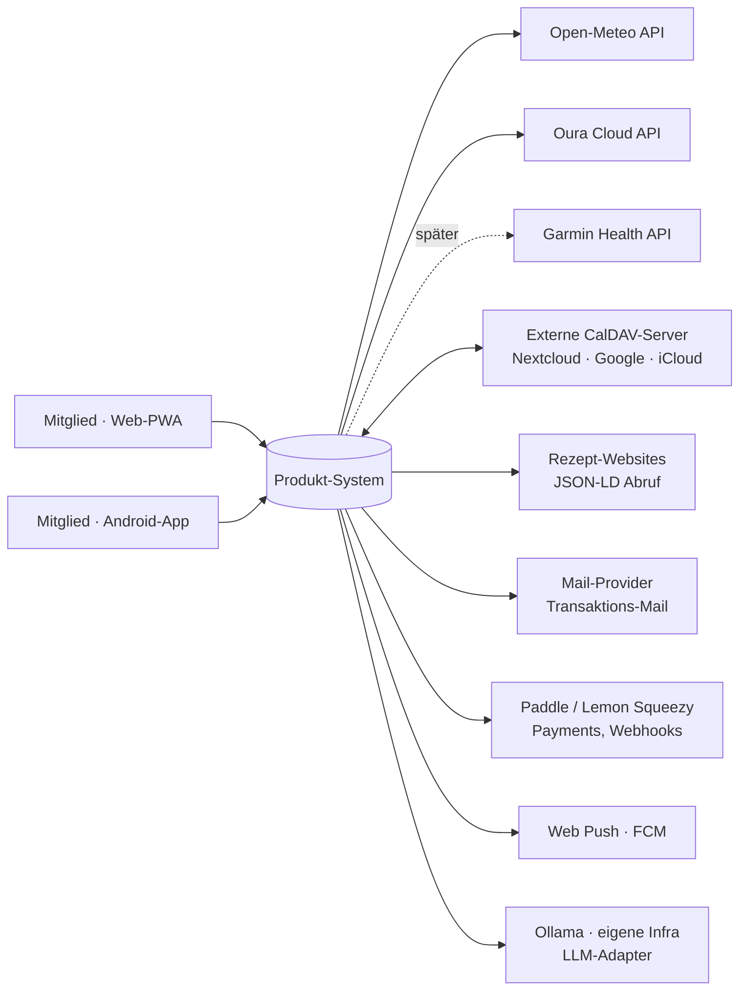
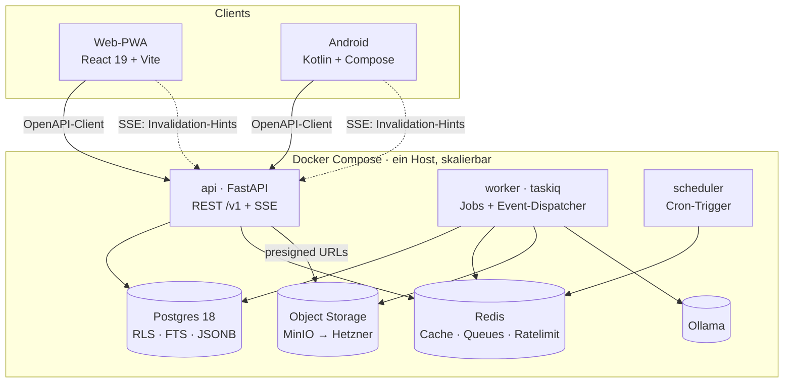

# ARCHITECTURE.md — Systemarchitektur (verbindlich)

> Ergänzt und detailliert KONZEPT.md §7. Bei technischen Fragen gilt dieses
> Dokument. Änderungen nur über ADRs (Abschnitt 17).
> Leitsatz: **State of the art heißt hier: modernste UX-Ergebnisse auf
> langweiliger, beherrschbarer Technik.** Innovation gehört ins Produkt,
> nicht in den Stack.

---

## 1. Architekturziele & Qualitätsattribute (quantifiziert)

Architektur wird an Zahlen gemessen, nicht an Adjektiven. Diese Budgets sind
Release-Kriterien (CI-geprüft, wo automatisierbar):

| Attribut | Budget | Messung |
|---|---|---|
| Interaktions-Latenz (lokale Aktion: abhaken, hinzufügen) | < 100 ms wahrgenommen (optimistic) | e2e + Profiling |
| API P95 einfache Reads | < 150 ms | Server-Timing, Sentry |
| API P95 Aggregate (Wochenplan, Dashboard) | < 400 ms | dito |
| Web LCP auf Mid-Range-Android, 4G | < 1,8 s | Lighthouse-CI |
| Initial-JS (Eager-Payload des Entry) | < 220 kB gz Mitglieder-App, < 160 kB gz Ops-Konsole | `web/scripts/check-bundle-size.mjs` in CI. **Nicht** je Route: gemessen wird, was ein Erstaufruf wirklich lädt (Route-Splitting seit Slice 5f), plus die Invariante, dass libsodium lazy bleibt |
| Offline-Einkaufsliste (App) | 0 Netzabhängigkeit für CRUD | Flugmodus-e2e |
| Sync-Korrektheit | kein bestätigter Write geht je verloren | Property-Tests §10 |
| RPO / RTO (Produktion) | ≤ 15 min / ≤ 4 h | WAL-Archivierung, Restore-Probe |
| Mandanten-Isolation | 0 Cross-Tenant-Reads möglich | RLS-Negativtests |
| Grundlast-Kosten Produktion | < 50 €/M bis ~1.000 Haushalte | Hosting-Rechnung |
| Verstehbarkeit | jedes Modul in < 1 Tag erfassbar | Doku-Pflicht (MODULES/*.md) |

---

## 2. C4 — Level 1: Systemkontext



Vertrauensgrenzen: alles rechts ist extern und wird über Ports/Adapter
(§8.3) angesprochen — austauschbar, gemockt testbar, einzeln abschaltbar
(Graceful Enhancement, KONZEPT §0 Leitplanke 7).

## 3. C4 — Level 2: Container



Ein Deployable-Trio (api, worker, scheduler) aus **einem** Code-Repo —
Modular Monolith (ADR-001). Kein Microservice-Zoo für einen Solo-Betreiber;
Extraktionspfade sind dokumentiert (§15).

## 4. C4 — Level 3: Module & erlaubte Abhängigkeiten

```
app/
├── kernel/                 # geteilter Kern — KEINE Fachlogik
│   ├── auth/               # Identität, Sessions, Rollen-Context
│   ├── tenancy/            # household-Scope, RLS-Session-Setup
│   ├── events/             # Outbox, Envelope, Dispatcher-Contracts
│   ├── sync/               # Sync-Batch (LWW), Idempotenz-Reaper
│   ├── retention/          # 30-Tage-Hard-Delete getombsteter Zeilen (P8-S3)
│   ├── deletion/           # Art.-17-Mechanik ohne Tabellennamen: purge.py (Konto, je Spalte,
│   │                       #   11-S1d) + household.py (Haushalt, Menge aus dem Katalog
│   │                       #   abgeleitet, Reihenfolge aus pg_constraint, 11-S1f/ADR-0086)
│   ├── export/             # Sammellauf für den Datenexport auf der Session des Aufrufers (ADR-0083)
│   ├── audit/              # append-only audit_log + record_audit (P8-S8a, ADR-0073)
│   ├── config/             # Feature-Flags + globale Flag-Overrides (global_flags, P8-S8c)
│   ├── crypto/             # Fernet-SecretBox für server-nutzbare Fremd-Credentials (P9-S1, ADR-0077)
│   ├── fetch.py            # SSRF-Guard: einziger erlaubter Ausgang ins offene Netz; origin-lockt
│   │                       #   Redirects bei JEDER Credential-Form (Basic + Bearer, P9)
│   ├── ports/              # Interfaces: weather, llm, push, mail, storage, payments, caldav,
│   │                       #   wearable (cloud + oauth), issues
│   ├── db/                 # Engine (app/maint/ops-Rollen), Basemodel, Migr.-Helpers
│   └── http/               # Fehlerformat, Pagination, Idempotency, SSE
├── modules/
│   ├── accounts/  recipes/  nutrition/  mealplanner/ shopping/
│   ├── tasks/     economy/  marketplace/ calendar/   scheduling/
│   ├── messaging/ guides/   notes/       vault/      wearables/
│   ├── weather/   capture/  feedback/    digest/     backoffice/
│   ├── comments/  links/
│   └── (geplant: finance — Phase 13; billing/Paddle — Phase 12)
├── adapters/               # Implementierungen der kernel/ports
├── main.py  worker.py      # Composition Root: Router-Montage, Cron, Outbox-Handler-Bindung
├── *_factory.py            # Port→Adapter-Wahl (caldav, wearable, mail, issue)
├── export_policy.py        # Klassifizierung ALLER Tabellen für den Datenexport (ADR-0083)
├── member_exit.py          # Quermodul-Ablauf „Austritt" in fester Reihenfolge (11-S1b)
├── household_dissolution.py # derselbe Ablauf eine Ebene höher: erst ALLE Handelspositionen,
│                           #   dann ALLE Aufgaben, dann ALLE Punkte-Verfälle (11-S1e/ADR-0085)
├── deletion_policy.py      # Konto-Purge: was aus jeder Spalte wird, die auf eine Person zeigt
├── account_purge.py        # Konto-Purge-Job (Cron 03:30) — eine Transaktion je Konto
├── household_deletion_policy.py # Haushalts-Purge: löschen oder behalten, je Tabelle (ADR-0086)
└── household_purge.py      # Haushalts-Purge-Job (Cron 04:00) — eine Transaktion je Haushalt,
                            #   Durchgang je Mitglied (mitglieds-gescopte RLS, ADR-0081)
```

**Abhängigkeitsregeln (CI-erzwungen via import-linter):**
1. `modules/*` dürfen nur `kernel/*` importieren — niemals einander.
2. Quermodul-Bedarf läuft über (a) Domain-Events oder (b) explizit
   exportierte Service-Interfaces des Zielmoduls (in dessen `api.py`).
3. `adapters/*` kennen `kernel/ports`, nichts sonst. Fachmodule kennen nur
   Ports, nie konkrete Adapter.
4. Kein Modul liest fremde Tabellen. Punkt.

**Event-Matrix (publiziert → abonniert), Auszug:**

| Event | Publisher | Subscriber |
|---|---|---|
| `recipe.imported` | recipes | nutrition (calc), messaging (notify) |
| `mealplan.updated` | mealplanner | shopping (diff-regen), messaging |
| `task.completed` | tasks | economy (ledger), scheduling (fairness), marketplace (settle), messaging |
| `market.listing.sold` | marketplace | tasks (reassign), messaging |
| `member.joined` | accounts | alle (UI-Refresh), messaging |
| `member.left` | accounts | calendar (Feed-Token + CalDAV-Abos), wearables (Art.-9-Daten), Composition Root (`member_exit.py`: Escrow, Aufgaben, Punkte-Verfall — in fester Reihenfolge) |
| `expense.created` · `settlement.completed` | finance | messaging |
| `capture.processed` | capture | shopping, tasks, notes, messaging (Feed) |
| `shopping.item.checked` | shopping | tasks (Aktivierung S-22), finance (S-06, später) |
| `calendar.event.flagged` (absence/guests) | calendar | scheduling (S-09), mealplanner (S-01) |

**Wearables publizieren bewusst KEINE Domain-Events** (ADR-0081 §6): der SSE-Fan-out ist
haushaltsweit, ein `wearable.*`-Hinweis würde Mitbewohnern verraten, dass jemand ein Wearable
verbunden hat oder Daten geliefert bekam (N-2). Die Naht zu Scheduling/Mealplanner ist stattdessen
der **synchrone, mitglieds-gescopte** Aufruf `wearables.api.recovery_signal` — ein Boolean, nie ein
Messwert.

---

## 5. Frontend-Architektur (Web-PWA)

**Stack:** React 19 + TypeScript (strict), Vite, TanStack Router (typisierte
Routen) + TanStack Query (Server-State), Zustand nur für flüchtigen UI-State,
react-hook-form + zod, Tailwind 4 auf eigenem Token-Set, Radix-Primitives als
Basis der eigenen Komponentenbibliothek, Lingui (ICU) für i18n, Framer Motion
für Mikro-Interaktionen (mit `prefers-reduced-motion`-Respekt).

**Grundsätze**
- **Server-State gehört Query, nicht Stores.** Jede Ressource hat genau einen
  Query-Key-Namensraum; SSE-Hints (§7) invalidieren gezielt.
- **Optimistic by default** für die Top-Aktionen (abhaken, hinzufügen,
  erledigen): sofortige UI-Reaktion, Rollback mit verständlicher Meldung bei
  Fehlschlag. Das ist der technische Träger der „Drei-Sekunden-Regel"
  (ENTWICKLUNGSKONZEPT P2).
- **Eine Validierungsquelle:** Typen **und** zod-Schemas stammen aus einem
  einzigen OpenAPI-Generator-Lauf (z. B. @hey-api/openapi-ts mit zod-Plugin) —
  nicht zwei parallele Generatoren; Frontend erfindet keine eigenen Regeln
  (Audit B-08).
- **Design System als Code:** Tokens (Farbe, Radius, Spacing, Typo, Motion)
  als CSS-Variablen; Komponenten-Galerie mit Ladle; Mitglieds-Farben sind
  Token-Slots (Personenfarbe zieht sich durch Kalender, Tasks, Avatare).
- **PWA:** vite-plugin-pwa (Workbox generateSW) — App-Shell-Precache mit
  **Prompt-Update** („Neue Version verfügbar", nie Auto-Reload). **Keine
  API-Antworten im SW-Cache** (`/v1` bleibt ungeroutet — Datenschutz auf
  geteilten Geräten; Dexie hinter dem Sync-Batch ist die einzige
  Offline-Datenquelle) und **Vordergrund-Sync statt Background-Sync-API**
  (iOS-Lücke; Outbox-Retry bei `online`/App-Fokus). Manifest-Name
  build-injiziert aus `BRAND_NAME`; Ops-Konsole nicht installierbar;
  dezenter Install-Hinweis (kein Nag). (ADR-0078)
- **Offline-Layer:** Dexie (IndexedDB) mit Tabellen `lists`, `items`,
  `outbox_ops`; Client-Repository spiegelt die API-Semantik (gleiche
  Operationen, gleiche Idempotenz-Keys) — der Sync-Code ist dadurch auf Web
  und Android konzeptidentisch.
- **Routen-Disziplin:** Code-Splitting pro Route; jedes Route-Modul liefert
  verpflichtend Loading-, Empty- und Error-Zustand (Trio-Regel).
- **A11y:** Radix + statisches `eslint-plugin-jsx-a11y` + **Laufzeit-axe-Gate**
  (`vitest-axe`) auf den querschnittlichen Kern-Bausteinen (Empty/Loading/Error-Trio,
  Button, DashboardTile; P8-S9a); vollständige Tastatur-Bedienbarkeit der Top-Flows;
  WCAG 2.2 AA. Lighthouse-Budgets + Mobile-QA (Live-Browser) offen.
- **Fehler-Transparenz:** Error-Boundaries pro Route, Sentry mit
  Source-Maps; Nutzer sehen nie Stacktraces, immer Handlungsoptionen.

## 6. Android-Architektur (Kurzfassung; Detail-Doc in der Android-Phase)

Kotlin + Jetpack Compose, MVVM mit Unidirectional Data Flow; **Room ist die
Source of Truth der UI** (Offline-First für Liste, Tasks, Rezepte-Cache);
Repository-Schicht kapselt Sync-Engine (WorkManager: periodisch + expedited
bei lokalen Änderungen + bei FCM-Ping); API-Client aus OpenAPI generiert;
identische Outbox-/Idempotenz-Semantik wie Web (§10); Health-Connect-Modul
als Adapter hinter demselben `wearables`-Port; FCM nur als „Wecksignal +
Anzeige", nie als Datentransport.

---

## 7. API-Design

- **REST unter `/v1`**, Ressourcen-Substantive, snake_case, opake
  Cursor-Pagination (keyset), Filter nur über Whitelist-Parameter.
- **Fehler:** RFC 9457 `application/problem+json` mit stabilen `type`-Codes;
  zentraler Fehlerkatalog `docs/errors.md`. Clients verzweigen auf `type`,
  nie auf Message-Strings.
- **Schreiben:**
  - Jeder POST trägt einen **Idempotency-Key** (Client-UUID); Server
    speichert Response-Snapshot 48 h → Retries sind gefahrlos (Mobilfunk!).
  - PATCH auf Einzelressourcen mit **ETag/If-Match** (Versionsfeld) —
    verlorene Updates werden zu expliziten 412-Konflikten statt stillem
    Überschreiben.
- **SSE statt WebSocket (ADR-002):** ein Stream `/v1/stream` pro
  Haushalts-Session. Events sind **Invalidation-Hints**
  `{entity, id, version}` ohne Payload — Client refetcht über die normale,
  autorisierte API. Vorteile: triviales Auth-Modell, automatisches
  Reconnect/Resume (`Last-Event-ID`), kein zweiter Berechtigungspfad.
  Betrieb: Keep-Alive-Kommentar alle 20 s (Idle-Timeouts von Proxy/
  Tunnel), Client mit Reconnect-Backoff (Audit B-02).
- **OpenAPI ist Vertrag:** FastAPI generiert das Schema; CI-Gate `oasdiff`
  blockiert Breaking Changes ohne Versions-Bump; Clients (openapi-ts,
  openapi-generator-kotlin) werden in CI regeneriert und committed —
  Drift ist unmöglich.
- **Eingehende Webhooks** (nur Paddle): Signatur-Verifikation, Replay-Schutz
  (Event-ID-Tabelle), Verarbeitung asynchron im Worker.

---

## 8. Backend-Architektur

### 8.1 Schichten je Modul
`router` (HTTP, dünn) → `service` (Use-Cases, Transaktionsgrenzen) →
`repository` (Persistenz). Domain-Objekte sind Pydantic-Modelle, getrennt
von ORM-Klassen — Services sind ohne HTTP und ohne echte DB testbar.

### 8.2 Domain-Events (Outbox, at-least-once)
- Envelope: `{id: uuid7, type, version, household_id, occurred_at, payload}`.
- Schreiben **in derselben Transaktion** wie die Fachänderung in
  `events_outbox` → kein Lost-Event bei Crash.
- Dispatcher (Worker) verteilt an registrierte Handler;
  `processed_events(handler, event_id)` macht jeden Handler idempotent;
  Retries exponentiell; nach N Fehlversuchen → `events_dlq` + Alert.
- Payloads sind versioniert; Handler tolerieren unbekannte Felder
  (Forward-Kompatibilität).

### 8.3 Ports & Adapter (Graceful Enhancement technisch)
Ports im Kernel: `WeatherPort`, `LlmPort`, `PushPort`, `MailPort`,
`StoragePort`, `PaymentsPort`, `WearableCloudPort`, `CaldavPort`.
Jeder Port hat: echten Adapter, **Null-Adapter** (Feature aus → definierte
neutrale Antworten) und Fake für Tests. Fachcode fragt nie „ist Wetter
konfiguriert?" — er bekommt vom Null-Adapter eine neutrale Antwort
(`forecast: unknown`), und die Scoring-Logik behandelt `unknown` als
gewichtsloses Signal. **So ist „funktioniert ohne Wearables/Wetter/KI
vollwertig" kein Sonderfall, sondern der Normalpfad.**

### 8.4 Jobs & Scheduling
taskiq (Redis-Broker) mit benannten Queues: `default`, `import` (Rezept-Fetch,
CPU/Netz), `external` (Oura/CalDAV/Wetter-Sync), `notify` (Push/Mail).
*Revision 06/2026 (ADR-008):* arq ist offiziell im Maintenance-only-Modus —
taskiq ist die aktiv gepflegte, async-native Wahl mit FastAPI-Integration.
Zustell-Garantien hängen ohnehin nicht am Broker: At-least-once + Idempotenz
liefern Outbox und `processed_events` (§8.2). Cron via taskiq-Scheduler
(ersetzt den separaten Scheduler-Prozess — Audit-📋-Punkt damit erledigt).
**Die neun Zeitpläne, wie sie in `app/worker.py` stehen** (Stand 2026-08-02 — die Liste hier war
zuvor ein Plan und nannte zwei Jobs, die es nicht gibt):

| Cron | Job | Zweck |
|---|---|---|
| `0 * * * *` | `reap_outbox` | verarbeitete Outbox-Zeilen + Idempotenz-Ledger |
| `30 * * * *` | `reap_sync_ops_job` | Sync-Batch-Idempotenzmarker (versetzt zum Outbox-Reaper) |
| `5,20,35,50 * * * *` | `sync_external_calendars_job` | CalDAV-Pull (Kill-Switch zuerst) |
| `0 3 * * *` | `reap_deleted_job` | Retention-Reaper, 30-Tage-Tombstones |
| `30 3 * * *` | `purge_due_accounts_job` | Konto-Purge nach der Karenz (Art. 17, 11-S1d) |
| `40 3 * * *` | `reap_wearable_daily_job` | 90-Tage-Retention Art.-9-Rohdaten (läuft auch bei Kill-Switch) |
| `0 4 * * *` | `purge_due_households_job` | Haushalts-Purge nach der Karenz (Art. 17, 11-S1f) |
| `20 4 * * *` | `ingest_wearables_job` | Oura-Ingest (Kill-Switch zuerst) |
| `0 7 * * 1` | `send_weekly_digest_job` | Wochen-Digest |

**Die Staffelung 03:00 → 03:30 → 04:00 ist Absicht**, nicht Zufall: erst der Reaper (Tombstones),
dann der Konto-Purge (personenbezogene Zeilen quer über alle Haushalte), dann der Haushalts-Purge
(der Rest eines beendeten Mandanten). Andersherum fasste jeder Job Zeilen an, die eine halbe Stunde
später ohnehin fielen — und alle drei laufen als `custode_maint` bzw. greifen auf dieselben
Tabellen zu, gleichzeitig wäre es unnötiges Sperrgeraufe.
**Nicht gebaut, obwohl hier früher genannt:** ein Wetter-Refresh-Cron (die Wetterdaten kommen
request-getrieben mit Redis-Cache) und der **Escrow-Verfall** — Letzterer ist eine echte offene
Zusage aus KONZEPT §5.10 und steht als eigener Punkt in der Roadmap.

### 8.5 Konfiguration & Flags
pydantic-settings, 12-Factor, ein `.env`-Schema für alle Umgebungen.
Feature-Flags zweistufig: global (Betreiber) und pro Haushalt (Admin,
KONZEPT §4.4) — beide im selben Auswertungs-Helper, damit UI und API
identisch entscheiden.

**Umsetzung (S10):** gemeinsamer Helper `kernel/config/flags.py::get_household_flags`
(Merge `DEFAULT_HOUSEHOLD_FLAGS` ← global `settings.feature_flags` ← `households.settings_json`;
harter Kinder-Default `marketplace_children=False`); `web/src/lib/flags.ts` spiegelt ihn 1:1
(Property-/Paritätstests). `/me` liefert die berechneten Flags an die Web-UI.

### 8.6 Backoffice-Sonderpfad (Betreiber-Konsole)
Das `backoffice`-Modul läuft im selben Deployable, aber strikt getrennt:
Router-Prefix `/ops` auf eigener Subdomain, eigener Auth-Stack (Tabelle
`operators`, Passwort + **TOTP** Pflicht — opake Redis-**Bearer**-Session,
kein Cookie/CSRF; **Passkey ✅** (P8, ADR-0072/0074), IP-Allowlist offen), kein
Haushalts-Kontext. Datenzugriff ausschließlich über Aggregat-Views
(`usage_counters`, `daily_metrics`, `household_metadata`, `ops_feedback`) und
auditierte Aktionen mit eigenen DB-Rollen `ops_readonly`/`ops_actions` —
Inhaltstabellen sind für diese Rollen nicht lesbar (Grants + RLS, ADR-0071).
Jede Schreibaktion schreibt ins append-only `audit_log` (ADR-0073). Stand
Phase 8: Backend vollständig (Auth, KPIs, Banner, globale Flags, Support-Suche,
Feedback-Inbox) **und das `/ops`-Frontend gebaut** — eigenes Vite-Bundle auf
eigener Subdomain mit Bearer-Client (kein Mitglieder-Cookie im Scope), ADR-0074:
Login → KPI-Dashboard → auditierte Banner/Flags → Support-Suche + Feedback-Inbox.
**Audit sensibler Reads ✅** und **Operator-Verwaltung im UI ✅** (P8); das Anlegen bleibt
bewusst CLI (`python -m app.scripts.create_operator <email>`, läuft auf `ops_actions`, gibt
Passwort + TOTP-Secret einmalig aus) — kein Self-Service für einen haushaltsübergreifenden
Zugang. Offen: IP-Allowlist.

Die Konsole wird als **Trio** mit zwei App-seitigen Geschwister-Modulen
ausgeliefert: `feedback` (Nutzer-Einsendungen → speisen die `ops_feedback`-View)
und `digest` (wöchentlicher Mail-Fan-out unter der maint-Rolle, ADR-0070).
Haushalts-Transparenz-Log (haushaltslesbar) folgt, sobald haushaltsbezogene
Betreiber-Aktionen existieren.

---

## 9. Datenarchitektur

- **Postgres 18, eine Datenbank.** Begründung: RLS (Mandanten-Isolation),
  FTS (deutsch + unaccent), JSONB, bewährte Backups — plus die 18er-Gewinne:
  natives `uuidv7()`, asynchrones I/O, Statistik-Erhalt bei Major-Upgrades
  (ADR-013, Recherche 06/2026).
- **Standard-Spalten jeder Fachtabelle:** `id` (UUIDv7 — zeitlich sortierbar,
  ADR-004; serverseitig via nativem `uuidv7()` in PG 18, clientseitig für
  Offline-Erzeugung per uuid7-Lib — beide RFC-9562-konform. Bewusste
  Nebenwirkung: IDs tragen den Erstellzeitpunkt; in unserer Domäne unkritisch), `household_id`, `created_at`, `updated_at` (Trigger),
  `version int` (Trigger-Inkrement; speist ETag und Sync), `deleted_at`
  (Tombstone — Sync-fähiges Löschen). **Drei Wege führen zum Hard-Delete, und nur der erste
  hängt am Tombstone:** der Retention-Reaper (03:00, Alter des `deleted_at`), der Konto-Purge
  (03:30, „diese Person", 11-S1d) und der Haushalts-Purge (04:00, „dieser Mandant", 11-S1f).
  Die beiden Purges sehen `deleted_at` der Fachzeilen **gar nicht** an — sie löschen entlang
  einer anderen Achse. Wer eine Tabelle anlegt, muss sie deshalb in **drei** Listen einordnen
  (`docs/MODULES/README.md`).
- **RLS konkret:** Middleware setzt `SET LOCAL app.household_id = …` pro
  Request-Transaktion; App-DB-User ohne BYPASSRLS; eine Policy-Vorlage für
  alle Tabellen; Pflicht-Negativtests („User A fragt Haushalt B" → 0 rows)
  in der Test-Suite jeder Tabelle. Worker setzen den Kontext explizit pro Job
  (`SET LOCAL` je Haushalt); haushaltsübergreifende Wartungs-Jobs (Retention,
  Digest-Fanout) laufen unter separater DB-Rolle mit eigenen, eng gefassten
  Policies (Audit B-01). Härtung (Final-Pass, Best-Practice-Recherche):
  `FORCE ROW LEVEL SECURITY` auf allen Tabellen (Table-Owner-Bypass!),
  Views mit `security_invoker = true`, CI-Check, dass die App-Rollen weder
  BYPASSRLS noch Tabellen-Ownership besitzen.
- **DB-Rollen (vier, `infra/postgres/init.sql`):** `custode_app` (App, NOBYPASSRLS, haushalts-
  gescopt), `custode_maint` (haushaltsübergreifende Wartung: Outbox-Dispatcher, Retention, Digest;
  `maint_all`-Policies statt BYPASSRLS), `ops_readonly` (Betreiber-Konsole — liest nur Aggregat-Views
  + `operators`/`audit_log`, **kein** Fachtabellen-Grant) und `ops_actions` (auditierte Betreiber-
  Schreibaktionen). ADR-0071.
- **Betreiber-Aggregat-Views (bewusste Ausnahme zu `security_invoker`):** die Ops-Views sind
  **security definer**, gehören `custode_maint` und aggregieren so über alle Haushalte, während
  `ops_readonly` keinerlei Fachzeile sieht — die DB-Durchsetzung von ADR-0015. Views:
  `usage_counters`, `daily_metrics` (KPIs), `household_metadata` (Support-Suche), `ops_feedback`
  (Feedback-Inbox).
- **Phase-8-Tabellen (Betreiber/Querschnitt):** `operators` (Operator-Auth, kein `household_id`,
  ops-only; ADR-0072), `audit_log` (append-only, kein UPDATE/DELETE-Grant; ADR-0073), `ops_banners`
  (global, app liest aktive), `global_flags` (operator-gesetzte Flag-Overrides; ADR-0015), `feedback`
  (Kanal an den Betreiber). **Sanftes Löschen:** Tombstone (`deleted_at`) → Papierkorb/Restore je Modul
  (P8-S4) → Hard-Delete erst durch den Retention-Reaper nach 30 Tagen (`kernel/retention`, P8-S3).
  **Stand 2026-08-02, ehrlich:** die Tombstone→Papierkorb→Reaper-Kette ist weiterhin erst für
  `notes` vollständig. Papierkorb/Restore gibt es nur dort; der Reaper leert `notes`,
  `external_calendar_subscriptions` und `calendar_events`. Alle übrigen Tombstones bleiben liegen
  — das ist **kein** Art.-17-Loch mehr (die Löschkaskade ist seit 11-S1d/11-S1f gebaut, s. u.),
  sondern eine fehlende **Komfort**-Funktion: gelöschte Rezepte oder Termine sind für den Nutzer
  weg, liegen aber technisch bis zur Konto- oder Haushaltslöschung in der Tabelle. Die
  Datenschutzerklärung ist damit eingelöst, die Papierkorb-Zusage aus diesem Absatz noch nicht.
  **Die Löschkaskade (Art. 17) läuft in zwei eigenen Jobs neben dem Reaper:**
  `purge_due_accounts_job` (03:30, `app/account_purge.py`, Klassifizierung je **Spalte** in
  `app/deletion_policy.py`; die `users`-Zeile bleibt anonymisiert stehen) und
  `purge_due_households_job` (04:00, `app/household_purge.py`, Klassifizierung je **Tabelle** in
  `app/household_deletion_policy.py`; die `households`-Zeile wird gelöscht, ihr Fehlen ist die
  Erledigt-Markierung). Der Haushalts-Purge **leitet seine Tabellenmenge zur Laufzeit aus dem
  Katalog ab** statt sie zu pflegen — kein Fremdschlüssel zeigt auf `households.id`, die Datenbank
  kann eine vergessene Tabelle also nie melden (ADR-0086) —, sortiert topologisch aus
  `pg_constraint` und **fällt geschlossen aus**: eine gefundene, nicht eingeordnete Tabelle bricht
  den Lauf ab, statt zu raten. Gelöscht wird als `custode_app` **unter RLS** (das DELETE nennt den
  Haushalt nicht) und **je Mitglied**, weil zwei Tabellen mitglieds-gescopte Policies tragen
  (ADR-0081) und ein Lauf unter einer Identität dort fehlerfrei „0 Zeilen" meldete.
  Der Reaper arbeitet **eine Transaktion je Tabelle** ab und meldet
  gescheiterte Tabellen (`RetentionResult.failed`); die frühere Sammel-Transaktion machte jeden
  Rechtefehler zum Totalausfall (BUGLOG 2026-07-31).
- **Migrationen:** Alembic, strikt **expand → backfill → contract** für
  Zero-Downtime; destruktive Schritte erst ein Release nach dem Expand.
- **FTS:** generierte `tsvector`-Spalten (Konfiguration `german` + unaccent),
  GIN-Indizes; Rezept- und Anleitungs-Suche zuerst hier (ADR-005);
  Meilisearch nur bei nachgewiesenem Qualitätsmangel (Schwelle §15).
- **Zahlen & Zeit:** Punkte/Geld als Integer (Cent/Punkt), Zeit ausschließlich
  `timestamptz` UTC; Rendering in Haushalts-TZ.
- **Wachstum:** `wearable_daily` und `audit_log` monatlich partitionierbar
  (vorbereitet, aktiviert bei Bedarf).

---

## 10. Sync-Protokoll v1 (Spezifikation)

> **Ein Datentyp, eine Konfliktstrategie (Audit B-04):** Sync-Batch ist der
> einzige Schreibpfad für offlinefähige Entitäten; ETag/PATCH (§7) gilt nur
> für nicht synchronisierte Ressourcen (Settings, Admin-Objekte).

**Pull:** `GET /v1/sync/{module}?cursor=&limit=` →
`{changes: [{entity, id, op: upsert|delete, version, updated_at, payload}],
next_cursor}`; Cursor = keyset `(updated_at, id)`; Tombstones erscheinen als
`delete` und bleiben 90 Tage verfügbar; älterer Cursor ⇒ Server antwortet
`410 resync_required` → Client macht Voll-Resync des Moduls.

**Push:** `POST /v1/sync/{module}/batch` mit
`[{client_op_id, entity, id, base_version, op, fields}]`.
- `client_op_id` = Idempotenz (Tabelle, 7 Tage) — Doppel-Sends sind no-ops.
- Konfliktregel: **Last-Write-Wins pro Feldgruppe** mit Server-Empfangszeit;
  Feldgruppen sind im Schema deklariert (z. B. `shopping_items`: Gruppe A =
  label/qty/unit/category, Gruppe B = `checked`) — Abhaken kollidiert nie mit
  Umbenennen.
- Antwort enthält **immer den autoritativen Server-Zustand** der berührten
  Entitäten; Client überschreibt lokal (Server ist Wahrheit, Client ist
  Cache + Absichts-Queue).
- Client-Uhren werden nie geglaubt; Reihenfolge bestimmt der Server.

**Pflicht-Testmatrix (Property- und Szenario-Tests):**
zwei Geräte offline editieren dasselbe Feld / verschiedene Felder /
löschen + editieren / erstellen mit Kollision / Replay alter Ops /
Resync nach Cursor-Verfall — Invariante: alle Clients konvergieren auf den
Server-Zustand, kein bestätigter Op geht verloren.

---

## 11. Dateien & Medien

Upload via presigned PUT (Client → Storage direkt, API bleibt schlank);
Worker-Pipeline: Content-Sniffing, Limits, EXIF-Strip, Derivate
(WebP/AVIF-Thumbnails); privater Bucket, Auslieferung über kurzlebige
signierte GETs; Pfadschema `household/{id}/{module}/{uuid}`.

## 12. Observability & Debuggability (Wartbarkeit ab Tag 1)

Grundsatz: **Jeder Fehler muss in unter fünf Minuten auffindbar, zuordenbar
und reproduzierbar sein.** Das ist ein Architekturziel mit Bauteilen, kein
Vorsatz.

- **Fehler-Referenzcode:** Jede nutzerseitige Fehlermeldung zeigt einen
  kopierbaren Kurzcode (abgeleitet aus `request_id`). Code → Trace, Logs und
  Sentry-Issue in Sekunden; derselbe Code ist das Bindeglied zu
  Support-Meldungen (KONZEPT 5.12) und zur Betreiber-Konsole.
- **Telemetrie-Standard:** OpenTelemetry-SDK (FastAPI-, HTTPX-,
  SQLAlchemy-Instrumentierung) ab Tag 1, Export per OTLP an Sentry — Errors
  und Traces in einem Backend, später ohne Codeänderung auf Grafana/Tempo
  umlenkbar (ADR-014). Frontend: Sentry mit Releases + Source Maps;
  `traceparent` verbindet Client- und Server-Spur.
- **Logs:** structlog JSON (`request_id`, `household_id`, `route`,
  `duration`); Log-Level pro Modul per Env schaltbar; Retention 30 Tage;
  niemals Inhalte/PII (Lint-Regel + Review-Punkt). `audit_log` separat,
  append-only.
- **Client-Diagnose:** Log-Ringpuffer im Client (Fehler + Breadcrumbs, ohne
  Inhalte) — wird ausschließlich opt-in an eine Feedback-Meldung angehängt.
- **Metriken:** `/metrics` (Prometheus-Format) ab Tag 1: HTTP-Raten/Latenzen,
  Queue-Tiefe & Job-Dauer, Sync-Erfolgsquote, SSE-Verbindungen, DB-Pool;
  `pg_stat_statements` aktiv mit monatlichem Review.
- **Alerting-Grundset:** Sentry (neue Issues, Error-Rate-Spike), Uptime-Kuma
  (extern gehostet), Queue-Tiefe über Schwelle, Backup-Job-Fehlschlag, Retention-Job mit gescheiterten Tabellen (`RetentionResult.failed`),
  Disk > 80 %, Zertifikats-/Domain-Ablauf.
- **SLOs + Error-Budget:** Verfügbarkeit 99,5 % (Beta) → 99,9 % (Produktion);
  API-Fehlerrate < 0,5 %; Sync-Erfolg > 99,9 %. Budget aufgebraucht ⇒
  Feature-Stopp und Stabilisierung (Ritual in ENTWICKLUNGSKONZEPT Teil C).
- **Debug-Werkzeuge:** `make seed-demo` (deterministischer Demo-Haushalt);
  Replay fehlgeschlagener Sync-Batches (7-Tage-Fixtures, KONZEPT §9);
  Kill-Switch je Port/Adapter (Wetter, LLM, Oura, CalDAV global abschaltbar);
  auditierte `ops`-CLI für Wartungs- und Backfill-Skripte.
- **Health & Build-Info:** `/healthz`, `/readyz` (DB/Redis/Storage),
  Build-Info-Endpoint (Version, Commit) — sichtbar in der Betreiber-Konsole.

## 13. Performance & Caching

Redis-Cache für Wetter (TTL 6 h), Zutaten-Suche, Nutrition-Lookups;
HTTP-ETags auf Collections; SQLAlchemy mit `lazy="raise"` in Tests
(N+1 wird zum Testfehler, nicht zum Produktionsproblem); EXPLAIN-Review als
Done-Kriterium für neue Listen-Endpoints; Statics über Cloudflare-CDN.

## 14. CI/CD & Umgebungen

GitLab-CE-Pipeline (Stages):
`lint` (ruff, mypy --strict, eslint, tsc) → `test` (pytest mit
Testcontainers-Postgres; vitest) → `contract` (oasdiff, Client-Regen-Diff
muss leer sein) → `e2e` (Playwright gegen Preview-Compose) → `build`
(Multi-Stage, non-root, Healthchecks) → `scan` (trivy, gitleaks) →
`deploy:staging` (auto) → `deploy:prod` (manuell).
Deploy-Reihenfolge: `migrate`-Job → rollendes `up`; Rollback = vorheriger
Image-Tag (Migrations sind durch expand/contract rückwärtskompatibel).
Umgebungen: `dev` (Compose lokal, Seed-Skript mit Demo-Haushalt),
`staging` und `beta/prod` auf dem Produktionsserver, später Hetzner (KONZEPT §11).

## 15. Skalierungspfad (mit Schwellen)

| Auslöser | Maßnahme |
|---|---|
| ~1.000 Haushalte oder CPU > 60 % | Worker auf eigenen Prozess-/Node-Slot, pgbouncer (Transaction-Pooling ist mit `SET LOCAL` kompatibel; asyncpg-Prepared-Statements dabei prüfen) |
| Import-Queue-Latenz > 1 min P95 | `import` als ersten Service extrahieren (eigenes Image, gleiche Codebase) |
| FTS-Relevanz-Beschwerden messbar | Meilisearch-Adapter aktivieren (Port existiert) |
| DB-Reads dominieren | Read-Replica + Query-Routing für Sync/Listen |
| > 10.000 Haushalte | Postgres auf eigenen Node, Object Storage CDN-frontiert, Multi-Node-Compose oder Nomad/K3s-Entscheid (ADR dann) |

## 16. Bedrohungsmodell-Seed (STRIDE, Auszug — Vollversion in docs/security/)

| Grenze | Top-Risiken | Gegenmaßnahme |
|---|---|---|
| Client ↔ API | Session-Diebstahl, CSRF, IDOR | Cookie-Flags, CSRF-Token, RLS + AuthZ-Matrix-Tests |
| API ↔ Rezeptseiten | **SSRF**, Riesen-Responses | Adapter: DNS-Pinning gegen private Ranges, Schema-Whitelist, Size/Timeout-Limits, kein Redirect > 3 |
| API ↔ Paddle | gefälschte Webhooks | Signaturprüfung, Replay-Tabelle |
| Worker ↔ LLM | Prompt-Injection aus Webseiten-Text | LLM-Output nie direkt persistieren: Schema-Validierung + Review-Screen |
| Storage | Public-Leak von Anhängen | privater Bucket, nur signierte URLs, Pfad-Unguessability |
| DB | Tenant-Leak | RLS + Negativtests, kein BYPASSRLS-User in der App |

## 17. ADR-Register (Grundsatz-ADRs 001–015)

> **Vollständiger Index ab ADR-016:** [`../docs/adr/README.md`](../docs/adr/README.md) (kanonisch, je
> ADR eine Einzeldatei — ADR-0018 „Single Source"). **Für den aktuellen Stand gilt ausschließlich
> dieser Index** — hier steht bewusst keine Nummer mehr, sie driftete sonst mit jedem Slice.
> Die Tabelle unten führt nur die Grundsatz-Entscheidungen 001–015.

| ADR | Entscheidung | Status |
|---|---|---|
| 001 | Modular Monolith statt Microservices | beschlossen |
| 002 | SSE-Invalidation-Hints statt WebSocket | beschlossen |
| 003 | LWW pro Feldgruppe statt CRDT | beschlossen |
| 004 | UUIDv7 als Primärschlüssel | beschlossen |
| 005 | Postgres FTS zuerst, Meilisearch hinter Port | beschlossen |
| 006 | Lingui/ICU, i18n ab Tag 1 — Sprachen: DE + EN | beschlossen |
| 007 | Radix-Primitives + Tailwind-Tokens als Design-System-Basis | beschlossen |
| 008 | taskiq als Job-System — revidiert: arq offiziell maintenance-only; Garantien via Outbox+Idempotenz, nicht Broker | revidiert 10.06.2026 |
| 009 | RFC-9457-Fehlerformat | beschlossen |
| 010 | Merchant of Record (Paddle) für Payments | beschlossen |
| 011 | Idempotency-Key auf allen POSTs | beschlossen |
| 012 | FCM nur als Wecksignal ohne Inhalte; UnifiedPush als spätere Option | beschlossen |
| 013 | Postgres 18 (natives uuidv7, Async-I/O, Statistik-Erhalt bei Upgrades) | beschlossen 10.06.2026 |
| 014 | OpenTelemetry-SDK ab Tag 1, Export per OTLP an Sentry (Backend austauschbar) | beschlossen 10.06.2026 |
| 015 | Betreiber-Inhalts-Grenze: Backoffice nur auf Aggregat-Views, nie auf Fachdaten | beschlossen 10.06.2026 |

## 18. Offene Architektur-Punkte

1. ~~Sprachumfang~~ — entschieden: DE + EN ab Start (ADR-006).
2. Ollama-Kapazität auf dem Produktionsserver für `assist` unter Mehrlast — messen in
   Phase 8, ggf. Modellwahl klein halten oder Feature-Flag-Drosselung.
3. Meilisearch-Aktivierungsschwelle (qualitativ) — Kriterien in Phase 7
   definieren.
