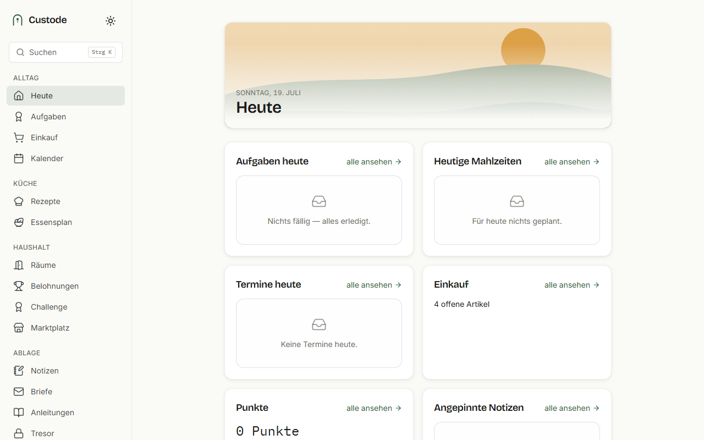
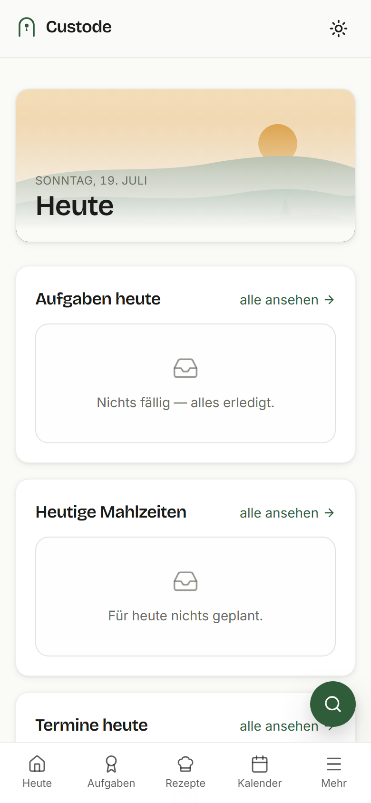
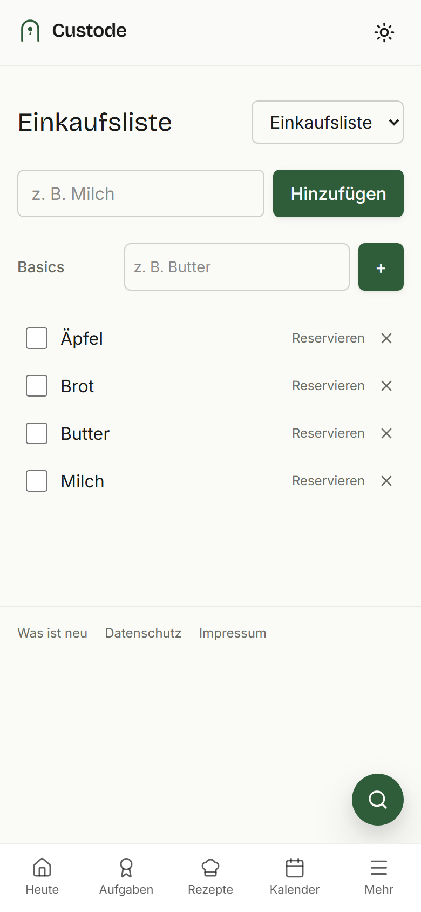
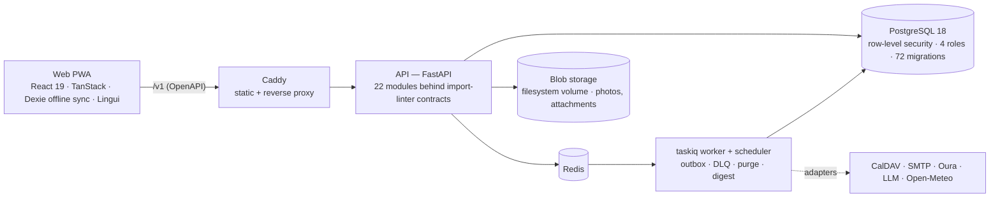

# Custode

**The operating system for your household — one app, EU-hosted, ad-free, open source.**

Custode is a household platform: recipes, meal planner, shopping list, personal and household
calendars with CalDAV sync, household tasks with a points economy and an internal marketplace, a
client-side encrypted vault for shared credentials, messaging, guides, notes, wearables (Oura),
weather and an LLM-assisted quick-capture. Web-first as an installable PWA; Android planned. Built
as a **modular monolith** (FastAPI + PostgreSQL 18 with row-level security, React 19 PWA) with the
kind of engineering discipline a multi-tenant product handling family data needs.

> **Status: prototype in beta.** Phases 0–9 of the [roadmap](KONFIG/Roadmap_to_V0.1.md) are built
> (all modules, CalDAV two-way sync, Oura, GDPR export and erasure); Phase 11 (hardening and legal)
> is in progress; Android (Phase 10) has not started. The maintainer runs one instance for a
> private household. No public hosted service exists yet. Issues and pull requests are welcome.
>
> **What has been checked, and what has not.** Two functional checks ran against a fresh clone
> — this README followed literally, the PWA used in a real browser, on the dev and the production
> stack: registration with mail verification, households with a second member and a child
> account, tasks, rooms, shopping, calendar (CalDAV against Radicale, ICS), notes, recipes,
> guides, quick-capture, letters, vault, passkeys and TOTP, tenant isolation, GDPR export, the
> operator console, backup and restore. They did **not** cover: real SMTP delivery (mail went to
> mailpit), the Oura integration, quick-capture with an LLM (only the deterministic path without
> one), hardware authenticators (passkeys were exercised with a virtual authenticator), and
> operation behind a TLS-terminating reverse proxy.

The product is designed in German — the concept and architecture documents in [`KONFIG/`](KONFIG/)
and the engineering notes in [`docs/`](docs/) are German by intent. The UI ships in German and
English (Lingui): it follows the browser language, falls back to German, and can be pinned per
browser under Profile → Language. This README and [`docs/ARCHITECTURE.md`](docs/ARCHITECTURE.md) are the English
entry points.

<p>
  
  
  
</p>

## Why

Households run on a dozen apps that do not talk to each other, sell the data, or both. Custode
puts the shared life of a household — cooking, shopping, chores, appointments, credentials,
messages, documentation — behind **one** tenant boundary that the database enforces, with a fair
economy for chores (a double-entry points ledger, not a leaderboard), without ads and with GDPR
rights built in from day one (export, erasure, purge jobs, consent for health data).

## Features

- **Recipes and meal planner** — import from URLs (SSRF-guarded), nutrition pipeline, week planner
  with least-recently-cooked and nutrition-aware auto-fill, cooked history, exclusion tags.
- **Shopping list** — generated from the plan, offline-capable, shared.
- **Calendars** — personal and household layers, RRULE recurrence with DST-correct TZIDs, ICS
  import/export with secret feeds, CalDAV pull sync and write-back (Nextcloud, Radicale, …).
- **Household tasks** — rooms, recurring tasks with value decay, a scheduling engine, a
  double-entry points ledger and a marketplace with escrow between members.
- **Vault** — shared credentials encrypted **client-side** (libsodium); the server never sees
  plaintext. One member sets the vault up; the others join it with the household's recovery
  code and their own passphrase.
- **Messaging, guides, notes, comments** — letters with read receipts, a household knowledge base
  with German full-text search, notes with version history, generic object links.
- **Wearables and weather** — Oura OAuth with Art. 9 consent and raw-data retention, Open-Meteo.
- **Quick-capture** — "Zuruf": dictate or type, an LLM adapter turns it into tasks, notes or
  shopping items via the normal sync path.
- **Accounts** — passkeys (WebAuthn), TOTP, child accounts with PIN, invite codes, household
  transparency log, operator console on its own subdomain with separate bearer auth.
- **GDPR** — export, household exit, account deletion with nightly purge, household dissolution
  ([`docs/LOESCHKONZEPT.md`](docs/LOESCHKONZEPT.md)).

## Architecture



Modules (`backend/app/modules/*`) import only `kernel/*`, never each other; cross-module
communication goes through domain events (outbox with DLQ) or exported service interfaces —
enforced in CI by 27 import-linter contracts. Every tenant boundary is a Postgres RLS policy with
`FORCE ROW LEVEL SECURITY` and a negative test. The OpenAPI schema is the single source for the
generated TypeScript client and zod schemas (drift gate + `oasdiff` on PRs). Details:
[`docs/ARCHITECTURE.md`](docs/ARCHITECTURE.md) (English), [`KONFIG/ARCHITECTURE.md`](KONFIG/ARCHITECTURE.md)
(full, German), [`docs/adr/`](docs/adr/) (ADR index), [`docs/MODULES/`](docs/MODULES/).

## Quick start

Requirements: [uv](https://docs.astral.sh/uv/), Node 22, GNU Make, Docker with Compose v2. No
system Python is needed: uv installs the interpreter pinned in `backend/.python-version` (3.13,
the same version the container image runs; `requires-python` is `>=3.12`, but 3.13 is what CI
and the image exercise).

```bash
git clone https://github.com/Juice-de-Orange/Custode.git
cd Custode
cp .env.example .env     # dev-safe defaults
make dev                 # api, worker, scheduler, postgres 18, redis, mailpit, radicale
make migrate             # alembic upgrade head
make seed-demo           # an invented, lived-in demo household (dev only)
make install             # uv sync (backend) + npm ci (web)
make web                 # Vite dev server on http://localhost:5173 (proxies /v1 to the API)
```

Log in with the demo account printed by `make seed-demo`. Mail lands in mailpit
(http://localhost:8025). The dev stack is for a developer machine only — it publishes its
database ports and uses fixed passwords.

## Self-hosting

The production stack is `docker-compose.prod.yml`: postgres, redis, api, worker, scheduler and
`web` (Caddy serving the built PWA and proxying `/v1` to the api). It expects a TLS-terminating
reverse proxy or tunnel in front and publishes no database ports. Background in ADR-0020 and
ADR-0024 (German).

**Bring-up.** On the host, in the cloned repository:

```bash
cp .env.prod.example .env    # then edit: every change-me, CUSTODE_PUBLIC_BASE_URL, OPS_HOST
openssl rand -hex 24         # one value per *_PASSWORD (no URL-special characters)
docker compose -f docker-compose.prod.yml build
docker compose -f docker-compose.prod.yml run --rm --no-deps api \
    python -c "from app.kernel.crypto import generate_key; print(generate_key())"   # → CUSTODE_CRYPTO_KEY
docker compose -f docker-compose.prod.yml up -d postgres redis
docker compose -f docker-compose.prod.yml run --rm api alembic upgrade head
docker compose -f docker-compose.prod.yml up -d
```

The database roles are created from the `.env` passwords on the **first** start of an empty
`pgdata` volume only. Migrations run before the app starts; an upgrade is the same sequence
after `git pull` (`build` → `run --rm api alembic upgrade head` → `up -d`).

**Attaching your proxy.** `web` deliberately publishes no host port. Either put your reverse
proxy or tunnel container on the stack's network (`custode_default`) and point it at
`http://web:80`, or publish the port to the host's loopback with a Compose override
(`services: {web: {ports: ["127.0.0.1:8081:80"]}}`) and proxy to that. Caddy speaks plain HTTP
on :80 for both site blocks. The operator console is a second site on the host name in
`OPS_HOST` (default `ops.localhost`), so the proxy must forward the original `Host` header. The
api's own port (`127.0.0.1:8080`) bypasses Caddy and is meant for health checks.

**First accounts.** Members register in the app; the first one creates the household. The
operator console has no sign-up — create the first operator on the host:

```bash
docker compose -f docker-compose.prod.yml run --rm api \
    python -m app.scripts.create_operator you@example.org
```

It prints a generated password and the TOTP secret exactly once (TOTP is mandatory for the
console); a re-run for the same address changes nothing.

**Without SMTP.** Leave `CUSTODE_SMTP_HOST` empty (the template ships a placeholder host —
clear it) and the app runs with a null mail adapter: registration and login work, accounts stay
"e-mail not verified" (nothing in the backend is gated on that flag), and **no mail is sent** — no
verification mail, no weekly digest and no password-reset mail. "Forgot password" still answers
204, so without SMTP a forgotten password cannot be reset by the user.

**Backup and restore.** State lives in two places: the `pgdata` volume (everything except
files) and the `storagedata` volume (recipe photos, guide attachments). `redisdata` holds only
the job queue and short-lived state (access tokens, WebAuthn challenges, the household each
signed-in session has active) and needs no backup. One visible consequence of restoring without
it: members who are still signed in land on "No active household" ("Kein Haushalt aktiv") until
they pick the household again on the account page or sign in again — nothing is lost. Keep the `.env` with the
backups — above all `CUSTODE_CRYPTO_KEY`: without the same key, stored CalDAV passwords and
wearable tokens are unreadable and must be entered again.

```bash
# backup
docker compose -f docker-compose.prod.yml exec -T postgres pg_dump -U custode -Fc custode > custode.dump
docker compose -f docker-compose.prod.yml run --rm --no-deps -T api tar czf - -C /data/storage . > storage.tgz

# restore into empty volumes (new host, or after `down -v`), with the saved .env in place
docker compose -f docker-compose.prod.yml up -d --wait postgres redis   # first init creates the roles
docker compose -f docker-compose.prod.yml exec -T postgres pg_restore -U custode -d custode < custode.dump
docker compose -f docker-compose.prod.yml run --rm --no-deps -T api tar xzf - -C /data/storage < storage.tgz
docker compose -f docker-compose.prod.yml run --rm api alembic upgrade head
docker compose -f docker-compose.prod.yml up -d
```

The dump carries no roles — they come from the init script, which is why the restore starts
postgres on an empty volume first.

## Development

```bash
make lint          # ruff, mypy --strict, eslint, tsc
make lint-imports  # module boundaries (import-linter)
make test          # pytest (Testcontainers: Postgres 18 + Redis + Radicale) + vitest
make openapi       # export the schema and regenerate the web client
make format
```

The backend suite needs Docker and takes 10–30 minutes; CI runs it in ~8 minutes. Gates are listed
in [`CLAUDE.md`](CLAUDE.md), which is the binding working instruction for humans and AI-assisted
sessions alike — module boundaries, definition of done, the review rules this codebase learned the
hard way. See [`CONTRIBUTING.md`](CONTRIBUTING.md).

## Tech stack

Python 3.13 · FastAPI · SQLAlchemy 2 (async) · Alembic · Pydantic v2 · PostgreSQL 18 (RLS) · Redis ·
taskiq · uv · ruff · mypy strict · import-linter · pytest + Testcontainers — React 19 · TypeScript
strict · Vite 6 · TanStack Router + Query · Dexie · Lingui · Tailwind 4 · vitest · axe · Lighthouse
CI — Docker Compose · Caddy · gitleaks · trivy.

## Third-party services

Custode is a self-hostable product; every external service is optional and brought by the operator:
an SMTP account, an Oura OAuth application (for wearables), an Open-Meteo plan (the free API is for
non-commercial use), and an LLM endpoint for quick-capture. Uploaded files are stored on a local
volume ([ADR-0033](docs/adr/0033-blob-storage-photos.md)); no object store is needed.

## Built with

The codebase was built in AI-assisted sessions working against `CLAUDE.md` and the concept
documents, with a definition of done per unit, a bug log with cause, fix, regression test and
lesson ([`docs/BUGLOG.md`](docs/BUGLOG.md)), and 80+ ADRs. German comments and commit messages in
the engineering docs are a trace of that workflow.

## Licence

[GNU AGPL-3.0](LICENSE) © 2026 Max Oberrauch. Custode is a network service: if you run a modified
version for others, §13 requires you to offer them the corresponding source — the footer link
"Source code" in the app is where that obligation is met. The bundled fonts (Inter, Bricolage
Grotesque, IBM Plex Mono via `@fontsource`) are under the SIL Open Font License 1.1; icons from
Lucide (ISC).
