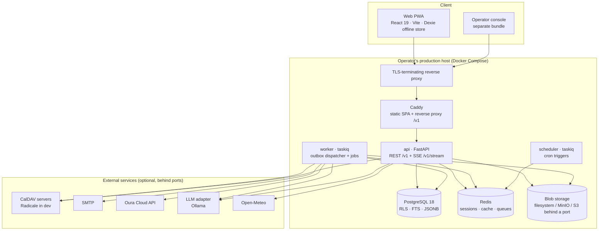

# Architecture overview

> English summary for readers who want the shape of the system in ten minutes. The binding,
> detailed architecture lives in [`KONFIG/ARCHITECTURE.md`](../KONFIG/ARCHITECTURE.md) (German);
> product scope and rules live in [`KONFIG/KONZEPT.md`](../KONFIG/KONZEPT.md) (German). On
> conflict, those documents win. Decisions are recorded as ADRs in [`adr/`](adr/README.md).

Custode is a household platform: recipes with nutrition, a weekly meal planner, an offline-capable
shopping list, personal and household calendars with CalDAV sync, household tasks with a
double-entry points ledger and a task marketplace, a client-side encrypted vault, messaging,
guides, notes, wearable data (Oura), weather, and an LLM-assisted quick-capture ("Zuruf").
It is built as a **modular monolith**: one Python code base deployed as three processes (API,
worker, scheduler) on top of PostgreSQL 18 and Redis, with a React 19 PWA in front. The guiding
principle is "state-of-the-art UX on boring, controllable technology": innovation belongs in the
product, not in the stack.

## 1. Containers



- **Caddy** serves the built SPA and reverse-proxies `/v1`, `/healthz` and `/readyz` to the API so
  that web and API share **one origin** (needed for `SameSite=Lax` cookies, ADR-0024). TLS is
  terminated by the operator's reverse proxy in front of it.
- **api / worker / scheduler** are one deployable trio from one repository (ADR-001).
- **Real-time** is Server-Sent Events, not WebSockets (ADR-002): `/v1/stream` emits invalidation
  hints `{entity, id, version}` without payload; the client refetches through the normal,
  authorised API. Keep-alive comments every ~20 s survive idle proxies.
- Every external system sits behind a **port** in `kernel/ports/` with a real adapter, a
  **null adapter** (feature off → neutral answers) and a fake for tests. Weather, wearables and
  LLM are optional; every feature has a full base path without them ("graceful enhancement").

## 2. Modular monolith

### Layout

```
backend/app/
├── kernel/     shared core, no domain logic: auth, tenancy, events (outbox), sync, retention,
│               deletion, export, audit, config (flags), crypto, fetch.py (SSRF guard),
│               ports/, db/ (engine + roles), http/ (problem details, pagination, SSE)
├── modules/    22 feature modules, each: router → service → repository, own models, tests, docs
├── adapters/   implementations of kernel/ports: caldav, smtp, oura, ollama, github, null
├── main.py     composition root of the API (router mounting)
├── worker.py   composition root of the worker (cron schedules, outbox handler binding)
└── *_policy.py / *_purge.py / member_exit.py / household_dissolution.py
                cross-module flows that must know every table (export, erasure, member exit)
```

### The 22 backend modules

| Module | Responsibility |
|---|---|
| `accounts` | Identity, households, memberships, roles, authentication |
| `recipes` | Recipe CRUD, import (JSON-LD / scraper / LLM), cooking mode |
| `nutrition` | Canonical ingredients, nutrition calculation |
| `shopping` | Shopping list, quick catalogue, offline sync batch |
| `tasks` | Household tasks, state machine, value decay, rooms |
| `economy` | Points ledger (append-only double-entry), rewards |
| `marketplace` | Trading tasks via escrow on the ledger |
| `capture` | Quick-capture: rule parser plus optional LLM enrichment |
| `calendar` | Personal and household calendars, RRULE, ICS, layers, CalDAV |
| `scheduling` | Read-only slot suggestions via `calendar.api` |
| `weather` | Open-Meteo provider plus null adapter |
| `mealplanner` | Weekly plan, auto-fill (nutrition- and absence-aware) |
| `messaging` | Letters (asynchronous, read receipts) |
| `guides` | How-to guides, German full-text search, attachments |
| `notes` | Notes, version history, trash/restore |
| `comments` | Generic object threads `(object_type, object_id)` |
| `links` | Generic, direction-agnostic object links |
| `vault` | Client-side end-to-end encrypted vault (server stores ciphertext) |
| `feedback` | In-app feedback channel to the operator |
| `digest` | Weekly e-mail overview (logic module, maintenance-role fan-out) |
| `backoffice` | Operator console `/ops` (auth, KPIs, actions; aggregate views only) |
| `wearables` | Wearable clouds (Oura), Art. 9 consent, member-scoped RLS |

### Dependency rules (enforced in CI by import-linter)

1. `modules/*` import only `kernel/*` — never each other's internals.
2. Cross-module needs go through (a) domain events or (b) the target module's explicitly
   exported service interface in `modules/<x>/api.py` (e.g. `tasks` credits points through
   `economy.api`, ADR-0035; the meal planner creates cook tasks through `tasks.api`, ADR-0053).
3. `adapters/*` know `kernel/ports` and nothing else; modules know ports, never concrete adapters.
4. No module reads another module's tables.

`backend/pyproject.toml` holds **27 import-linter contracts**: three layer contracts
(kernel ↛ modules/adapters, adapters ↛ modules, modules ↛ adapters) and 24 per-module
contracts that pin each module to the public `api.py` of the modules it may call and forbid
everything else (e.g. `economy must not depend on other modules`, `wearables must not be
imported by other modules`).

### Domain events

Events are written to `events_outbox` **in the same transaction** as the business change
(envelope `{id: uuid7, type, version, household_id, occurred_at, payload}`). The worker's
dispatcher drains the outbox (`FOR UPDATE SKIP LOCKED`, safe with concurrent workers), fans out
to registered handlers, and records `processed_events(handler, event_id)` so every handler is
idempotent. Retries are exponential; after the attempt limit an event moves to `events_dlq`.
Delivery guarantees therefore come from the outbox and the idempotency ledger, not from the
broker (ADR-008). Handlers with domain side effects are registered at the composition root in
`worker.py`, because the kernel must not import modules (ADR-0039). Wearables deliberately publish
no events: the SSE fan-out is household-wide and would reveal to other members that someone
connected a wearable (ADR-0081).

## 3. Multi-tenancy and security

**Row-level security.** Every business row carries `household_id`. The request middleware sets
`SET LOCAL app.household_id = …` per transaction; all tables carry `FORCE ROW LEVEL SECURITY`
(so even the table owner cannot bypass), views use `security_invoker`, and a CI check asserts that
the application roles hold neither `BYPASSRLS` nor table ownership. Tables holding Art. 9 health
data add `member_id` to the policy predicate (ADR-0081). Reference data is the one documented
RLS exception (ADR-0031).

**Four database roles** (`infra/postgres/init.sql`, ADR-0071):

| Role | May touch |
|---|---|
| `custode_app` | The API, household-scoped by RLS, `NOBYPASSRLS` |
| `custode_maint` | Cross-household maintenance: outbox dispatcher, retention reaper, digest fan-out — via narrow `maint_all` policies, not `BYPASSRLS` |
| `ops_readonly` | Operator console reads: aggregate views (`usage_counters`, `daily_metrics`, `household_metadata`, `ops_feedback`) plus `operators` / `audit_log`; **no grant on content tables** |
| `ops_actions` | Audited operator write actions |

The operator aggregate views are `security definer` views owned by `custode_maint`, so the
console can count across households without ever seeing a content row (ADR-015).

**Negative test per policy.** Every new table needs a test proving that a member of household A
asking for household B gets zero rows — and, where `member_id` is in the predicate, that another
member of the same household gets zero rows too — plus the counter-check that the authorised
member does get through.

**Authentication.** Passwords are Argon2id; opaque access tokens live in Redis and are carried in
`httpOnly` cookies with a double-submit CSRF token on unsafe methods (ADR-0021); refresh tokens
rotate with reuse detection. TOTP two-factor (ADR-0022) and passkeys / WebAuthn (ADR-0023) are
built in; child accounts log in with username + rate-limited PIN scoped to the household
(ADR-0028). The operator console has its own auth stack (password + mandatory TOTP, passkeys,
bearer session) with no household context (ADR-0072).

**Outbound requests.** `kernel/fetch.py` is the only path to the open network: http(s) only,
DNS resolution checked against private and link-local ranges, redirect limit, timeouts, size
caps, and redirects origin-locked whenever any credential is attached (ADR-0030).

**Encryption.** Vault entries are encrypted in the browser with libsodium (loaded lazily); the
server stores only ciphertext (ADR-0067). Third-party credentials the server itself must use
(CalDAV passwords, OAuth tokens) are encrypted at rest with a Fernet key from the environment
(`kernel/crypto`, ADR-0077).

**GDPR.** Data export (Art. 15/20) classifies every table at the composition root and runs under
the caller's RLS session, with a redaction denylist gated in CI (ADR-0083). Account deletion and
household dissolution take effect immediately (sessions revoked, feeds and subscriptions
invalidated, health data hard-deleted, economy settled) and are purged after a 30-day grace
period by nightly jobs; the household purge derives its table set from the catalogue at runtime
and fails closed on any unclassified table (ADR-0085, ADR-0086). `audit_log` is pseudonymised,
not deleted (ADR-0084). Full walkthrough: [`LOESCHKONZEPT.md`](LOESCHKONZEPT.md).

## 4. API contract

- REST under `/v1`, resource nouns, `snake_case`, opaque keyset cursor pagination.
- **OpenAPI is the contract.** FastAPI exports `backend/openapi.json`; a single
  `@hey-api/openapi-ts` run generates the TypeScript client **and** the zod schemas in
  `web/src/api` — the frontend never invents its own validation rules.
- CI regenerates both and fails on any diff (**drift gate**); on pull requests `oasdiff breaking`
  compares against the base branch's schema and fails on breaking changes.
- Every POST carries an **Idempotency-Key** (ADR-011); PATCH uses ETag / `If-Match` so lost
  updates become explicit 412 conflicts. Offline-capable entities are written **only** through the
  sync batch (section 5), everything else only through PATCH + `If-Match` — never both for one
  type.
- Errors are **RFC 9457** `application/problem+json` with a stable `type` slug and a copyable
  `reference` code derived from the request id (ADR-009). The catalogue in
  [`errors.md`](errors.md) is held in sync with the code by a two-way test; clients branch on
  `type`, never on message strings.

## 5. Web client

- **Stack:** React 19 + TypeScript (strict), Vite, TanStack Router (typed routes) and TanStack
  Query (server state), Zustand only for ephemeral UI state, react-hook-form + zod, Tailwind on
  an own token set, Radix primitives (ADR-007), Lingui with ICU messages for DE and EN (ADR-006).
- **Offline sync:** Dexie (IndexedDB) holds `lists`, `items`, an `outbox` of pending operations,
  the quick catalogue and basics. Push goes through `POST /v1/sync/{module}/batch` with
  `client_op_id` idempotency; conflicts resolve by **last-write-wins per declared field group**
  (e.g. label/qty/unit vs. `checked`), so ticking an item never collides with renaming it
  (ADR-003, ADR-0032). The response always carries the authoritative server state.
- **Optimistic by default** for the top actions (tick, add, complete) with rollback and a
  readable message on failure; SSE hints invalidate query keys selectively.
- **PWA:** vite-plugin-pwa with app-shell precache and prompt-based updates; API responses are
  never cached by the service worker (shared devices), foreground sync instead of the Background
  Sync API (ADR-0078). A CI gate (`check:pwa`) verifies manifest, service worker and the brand rule.
- **Budgets:** initial JS < 220 kB gz for the member app and < 160 kB gz for the operator
  console, libsodium must stay lazy (`scripts/check-bundle-size.mjs`); Lighthouse CI asserts
  mobile budgets on the core route.
- **Operator console** is a second Vite entry (`index-ops.html`) with its own bundle and a
  bearer-token client, excluded from the member precache and not installable (ADR-0074).
- Accessibility: Radix + `eslint-plugin-jsx-a11y` + runtime axe checks in vitest on the core
  building blocks; every route module ships loading, empty and error states.

## 6. Background work

`worker.py` is both worker and scheduler for taskiq on a Redis list broker. The worker starts the
outbox dispatch loop on startup and binds the module outbox handlers (capture, comments, links,
calendar, wearables, member exit, household dissolution, feedback forwarding) at the composition
root (ADR-0039). The scheduler fires nine cron jobs:

| Cron | Job | Purpose |
|---|---|---|
| hourly `:00` | `reap_outbox` | drop processed outbox rows and stale idempotency entries |
| hourly `:30` | `reap_sync_ops_job` | drop old sync-batch idempotency markers |
| every 15 min | `sync_external_calendars_job` | CalDAV pull for enabled subscriptions (kill switch first, ADR-0079) |
| 03:00 daily | `reap_deleted_job` | retention reaper: hard-delete 30-day-old tombstones |
| 03:30 daily | `purge_due_accounts_job` | account purge after the grace period (Art. 17) |
| 03:40 daily | `reap_wearable_daily_job` | 90-day retention of raw wearable values |
| 04:00 daily | `purge_due_households_job` | household purge after the grace period (ADR-0086) |
| 04:20 daily | `ingest_wearables_job` | Oura ingest (kill switch first) |
| Mon 07:00 | `send_weekly_digest_job` | weekly e-mail digest under the maintenance role (ADR-0070) |

The 03:00 → 03:30 → 04:00 order is deliberate: tombstones first, then person-scoped rows across
households, then the remainder of a dissolved tenant, so the three maintenance jobs never
contend for the same rows.

## 7. Quality gates

All gates are blocking in `.github/workflows/ci.yml` and run on every push and pull request:

| Job | Steps |
|---|---|
| `backend` | `ruff check` + `ruff format --check`, `mypy --strict`, `lint-imports` (27 contracts), `pytest` against a Testcontainers PostgreSQL 18 (one container per session, one database per module from a migrated template; a run that skips tests for missing infrastructure fails) |
| `web` | eslint, `tsc --strict`, vitest (incl. axe on core components), `vite build`, bundle-size gate, PWA gate, Lighthouse CI |
| `contract` | export `backend/openapi.json`, regenerate the web client, fail on drift; `oasdiff breaking` on pull requests |
| `security` | gitleaks over the commit range, trivy filesystem scan (HIGH/CRITICAL, fail on findings) |

Test volume at the time of writing: roughly 950 backend test functions in 128 files and roughly
330 web test cases in 70 files. Backend tests include the RLS negative tests per table, property
tests for the ledger invariants (balances are sums, never negative, every movement references a
business event), the sync convergence scenarios, and tests for both the null-adapter and the
real-adapter path of every optional feature.

## 8. Where to read more

| Document | Contents |
|---|---|
| [`KONFIG/KONZEPT.md`](../KONFIG/KONZEPT.md) | What and why: modules, rules, data model, roadmap (German) |
| [`KONFIG/ARCHITECTURE.md`](../KONFIG/ARCHITECTURE.md) | Full technical architecture: C4, API, sync protocol, RLS, observability, scaling thresholds (German) |
| [`MODULES/`](MODULES/README.md) | One document per module: purpose, data objects, events and services, authorisation matrix, tests |
| [`adr/README.md`](adr/README.md) | ADR index: 001–015 foundational decisions, 016 onwards as individual files |
| [`errors.md`](errors.md) | RFC 9457 error catalogue |
| [`LOESCHKONZEPT.md`](LOESCHKONZEPT.md) | Deletion concept: member exit, account deletion, household dissolution, purge jobs |
| [`patterns.md`](patterns.md) | Pattern catalogue: pagination, error handling, forms, sync |
